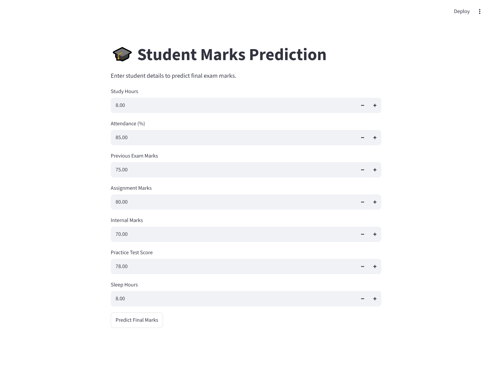

# Student Marks Prediction System 🎓

A Machine learning web application built with **streamlit** and **linear Regression** to predict student marks based on academic and study-related factors.


---

## 📌 Features & Input Factors
The model evaluates the following inputs to predict final exam performance:
* 📖 **Study Hours** (Daily study time)[span_3](start_span)[span_3](end_span)
* 🏫 **Attendance Percentage** (%)[span_4](start_span)[span_4](end_span)
* 📝 **Previous Exam Marks**[span_5](start_span)[span_5](end_span)
* 📊 **Assignment Marks**[span_6](start_span)[span_6](end_span)
* ✍️ **Internal Marks**[span_7](start_span)[span_7](end_span)
* 🧪 **Practice Test Score**[span_8](start_span)[span_8](end_span)
* 😴 **Sleep Hours** (Daily sleep duration)[span_9](start_span)[span_9](end_span)

---

## 📁 Project Structure
```text
student_marks_prediction/
├── app.py                      # Streamlit UI Application
├── student-marks.py            # Model training & preprocessing script
├── student_marks_model.pkl     # Saved Trained Linear Regression Model
├── create_db.py                # Database setup script
├── prediction.db               # SQLite database storing prediction history
├── .gitignore                  # Git ignored files
└── README.md                   # Project documentation
